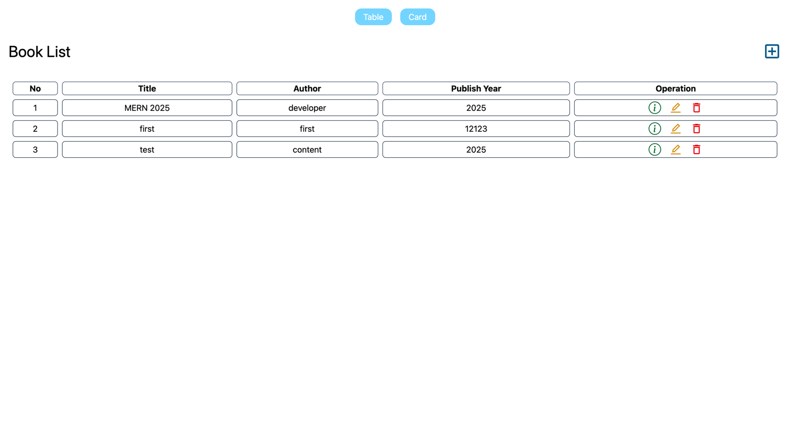

# Book Store MERN



### Backend

BackEnd CRUD and API testing with Postman

| Backend Tech | Languages |
|-------------:|-----------|
|            1 | Express   |
|            2 | Nodejs    |
|            3 | mongoose  |
|            4 | cors      |

FrontEnd CRUD

| Front Tech | Languages        |
|-----------:|------------------|
|          1 | React            |
|          2 | Vite             |
|          3 | react-router-dom |
|          4 | react-icons      |
|          5 | tailwindCSS      |
|          6 | axios            |

### How to get the code and execute the code

Some basic commands are:
```
git clone git@github.com:Jo-zefu/book-store-MERN.git
terminal1: cd backend -> npm intall -> npm run dev
terminal2: cd frontend -> npm install -> npm run dev
```

Open the dev website http://localhost:5173/
